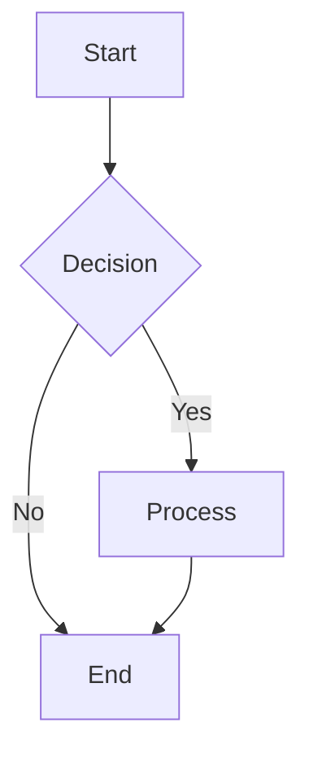
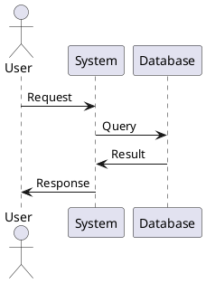

# MarkFlow — Intelligent Markdown Editor

## The Problem

- Markdown editing is tedious and error-prone
- No real-time preview with advanced features
- Poor collaboration tools for documentation
- Manual table of contents and cross-references

## The Solution

MarkFlow provides an intelligent markdown editor with AI-powered writing assistance, real-time collaboration, and advanced document management.

## Features

- ✍️ AI-powered writing assistance
- 📝 Real-time collaborative editing
- 🔍 Smart content suggestions
- 📊 Advanced table and diagram support
- 🔗 Automatic cross-referencing
- 📋 Template library

## How It Works

### Desktop Application Usage

```bash
# Launch MarkFlow
markflow

# Open specific file
markflow document.md

# Start with template
markflow --template technical-spec

# Collaborative session
markflow --share document.md
```

### Web Interface

```bash
# Start web server
markflow serve --port 3000

# Share editing session
markflow share --url custom-url --password secure123
```

### API Usage (Praximous Skill)

```bash
POST /api/v1/process
{
  "task_type": "markflow_edit",
  "document": "# My Document\n\nContent here...",
  "action": "improve_writing"
}
```

## Core Features

### AI Writing Assistant

- **Content Suggestions**: Context-aware content recommendations
- **Grammar & Style**: Real-time writing improvement
- **Structure Optimization**: Document organization suggestions
- **Tone Adjustment**: Match your writing style and audience

### Real-time Collaboration

- **Live Editing**: Multiple users editing simultaneously
- **Change Tracking**: See who changed what and when
- **Comments & Reviews**: Inline comments and suggestions
- **Version History**: Full document history with restore points

### Advanced Markdown Support

- **Extended Syntax**: Tables, footnotes, math equations, diagrams
- **Custom Components**: Reusable content blocks
- **Template System**: Document templates and snippets
- **Export Options**: PDF, HTML, DOCX, LaTeX

## Installation

### Desktop Application

```bash
# Download from releases
curl -L https://github.com/adaptive-intelligence/markflow/releases/latest/download/markflow-installer.exe

# Install via npm
npm install -g @adaptive-intelligence/markflow

# Install via pip
pip install markflow-editor
```

### Web Version

```bash
# Clone and setup
git clone https://github.com/adaptive-intelligence/markflow.git
cd markflow
npm install
npm run build
npm start
```

### VS Code Extension

```bash
# Install from marketplace
code --install-extension adaptive-intelligence.markflow

# Or search for "MarkFlow" in Extensions panel
```

## Writing Assistant Features

### Content Generation

```markdown
<!-- Ask AI to expand on ideas -->
{ai:expand}
Brief outline of the feature
{/ai:expand}

<!-- Generate examples -->
{ai:examples topic="API endpoints"}

<!-- Create tables from description -->
{ai:table}
Create a comparison table of database solutions including 
MySQL, PostgreSQL, and MongoDB with columns for performance, 
scalability, and use cases
{/ai:table}
```

### Writing Improvement

```markdown
<!-- Check grammar and style -->
{ai:improve}
This sentence could be wrote better and more clear.
{/ai:improve}

<!-- Adjust tone -->
{ai:tone style="professional"}
Hey there! This API is pretty cool and does awesome stuff.
{/ai:tone}

<!-- Simplify complex text -->
{ai:simplify}
The implementation leverages a sophisticated algorithmic approach 
utilizing machine learning paradigms to optimize performance metrics.
{/ai:simplify}
```

### Smart Completions

- **Heading Suggestions**: Auto-suggest section headings
- **List Completions**: Continue lists based on context
- **Code Block Languages**: Auto-detect programming languages
- **Link Suggestions**: Suggest relevant internal and external links

## Collaboration Features

### Real-time Editing

```bash
# Start collaborative session
markflow collaborate --document project-spec.md --invite user@email.com

# Join existing session
markflow join --session-id abc123 --name "John Doe"

# Share read-only view
markflow share --read-only --public-link
```

### Review System

```markdown
<!-- Add comments -->
This section needs clarification {comment: What specific metrics?}

<!-- Suggest changes -->
{suggest}
Original: Our API is very fast
Suggested: Our API responds in under 100ms for 95% of requests
{/suggest}

<!-- Request review -->
{review:@john-doe}
Please review the security considerations section
{/review}
```

### Version Control Integration

- **Git Integration**: Automatic commit creation for major changes
- **Branch Support**: Work on different document versions
- **Merge Conflicts**: Visual resolution of conflicting edits
- **Change Notifications**: Email/Slack alerts for document updates

## Advanced Markdown Features

### Enhanced Tables

```markdown
| Feature | Basic | Pro | Enterprise |
|---------|:-----:|:---:|:----------:|
| Users | 5 | 50 | Unlimited |
| Storage | 1GB | 100GB | Custom |
| Support | Email | Priority | Dedicated |
{.responsive .sortable}

<!-- Advanced table with merged cells -->
| Quarter | Q1 | Q2 | Q3 | Q4 |
|---------|:--:|:--:|:--:|:--:|
| Revenue | $100K || $150K | $200K |
| Growth | 10% | 25% | 15% | 33% |
{.merge-cells}
```

### Diagrams and Charts

```markdown
<!-- Mermaid diagrams -->


<!-- PlantUML diagrams -->


<!-- Charts -->
```chart
type: bar
data:
  labels: [Jan, Feb, Mar, Apr, May]
  datasets:
    - label: Sales
      data: [65, 59, 80, 81, 56]
      backgroundColor: rgba(75, 192, 192, 0.2)
```

```txt

### Math and Formulas

```markdown
<!-- Inline math -->
The quadratic formula is $x = \frac{-b \pm \sqrt{b^2 - 4ac}}{2a}$

<!-- Block math -->
$$
\int_{-\infty}^{\infty} e^{-x^2} dx = \sqrt{\pi}
$$

<!-- Chemical formulas -->
The reaction is: $\ce{2H2 + O2 -> 2H2O}$
```

### Custom Components

```markdown
<!-- Callout boxes -->
{callout type="warning"}
This feature is deprecated and will be removed in v2.0
{/callout}

<!-- Code examples with execution -->
{code-example lang="javascript" executable}
const greeting = (name) => `Hello, ${name}!`;
console.log(greeting("World"));
{/code-example}

<!-- Tabbed content -->
{tabs}
{tab title="JavaScript"}
```javascript
function hello() {
  console.log("Hello");
}
```

{/tab}
{tab title="Python"}

```python
def hello():
    print("Hello")
```

{/tab}
{/tabs}

```txt

## Templates and Snippets

### Built-in Templates

```bash
# Technical documentation
markflow new --template tech-spec

# API documentation
markflow new --template api-docs

# User guide
markflow new --template user-guide

# Meeting notes
markflow new --template meeting-notes

# Project README
markflow new --template readme
```

### Custom Templates

```yaml
# .markflow/templates/my-template.yml
name: "Project Proposal"
description: "Template for project proposals"
files:
  - name: "proposal.md"
    content: |
      # {{project_name}} Proposal
      
      ## Executive Summary
      {ai:placeholder}Brief overview of the project{/ai:placeholder}
      
      ## Objectives
      - {ai:placeholder}Primary objective{/ai:placeholder}
      - {ai:placeholder}Secondary objective{/ai:placeholder}
      
      ## Timeline
      | Phase | Duration | Deliverables |
      |-------|----------|--------------|
      | {ai:placeholder}Phase 1{/ai:placeholder} | {ai:placeholder}2 weeks{/ai:placeholder} | {ai:placeholder}Deliverable{/ai:placeholder} |
      
variables:
  - name: "project_name"
    prompt: "Enter project name:"
    type: "string"
  - name: "team_size"
    prompt: "Team size:"
    type: "number"
```

### Smart Snippets

```markdown
<!-- Auto-expanding snippets -->
api → 
```markdown
## API Endpoint

**URL:** `{{method}} {{endpoint}}`

**Parameters:**
| Parameter | Type | Required | Description |
|-----------|------|----------|-------------|
| {{param}} | {{type}} | {{required}} | {{description}} |

**Response:**
```json
{
  "status": "success",
  "data": {}
}
```

```txt

## Configuration

### Application Settings

```yaml
# ~/.markflow/config.yml
editor:
  theme: "github-dark"
  font_family: "JetBrains Mono"
  font_size: 14
  line_numbers: true
  word_wrap: true
  vim_mode: false

ai_assistant:
  provider: "openai"  # openai, anthropic, local
  model: "gpt-4"
  temperature: 0.7
  max_tokens: 2000
  enabled_features:
    - content_suggestions
    - grammar_check
    - style_improvement
    - auto_completion

collaboration:
  auto_save_interval: 30  # seconds
  conflict_resolution: "merge"  # merge, overwrite, prompt
  notifications:
    email: true
    slack: false
    discord: false

export:
  default_format: "pdf"
  pdf_options:
    margin: "1in"
    font_size: "12pt"
    header_footer: true
  html_options:
    syntax_highlighting: true
    table_of_contents: true
    custom_css: "styles/custom.css"

plugins:
  enabled:
    - mermaid
    - plantuml
    - katex
    - prism
  custom_plugins_path: "~/.markflow/plugins/"
```

### Project Settings

```yaml
# .markflow/project.yml
project:
  name: "Documentation Project"
  type: "technical-docs"
  language: "en"

structure:
  enforce_template: true
  required_sections:
    - "introduction"
    - "installation"
    - "usage"
    - "api-reference"
  
  auto_toc: true
  cross_reference_check: true

style_guide:
  heading_style: "atx"  # atx (#) or setext (===)
  list_style: "dash"    # dash (-) or asterisk (*)
  code_fence: "backtick"  # backtick (```) or tilde (~~~)
  
writing_rules:
  max_line_length: 80
  check_spelling: true
  check_grammar: true
  preferred_voice: "active"
  target_reading_level: "grade-8"

collaboration:
  allowed_users:
    - "user@domain.com"
    - "team@company.com"
  permissions:
    "user@domain.com": "edit"
    "team@company.com": "comment"
```

## Integration Points

- → **TreeCraft**: Organize documentation projects
- → **CertiScope**: Verify external links and references
- → **Aegis**: Security review for sensitive documentation
- → **GitHub/GitLab**: Version control and collaboration

## Use Cases

### Technical Documentation

```bash
# API documentation project
markflow new --template api-docs --name "API Reference"

# Auto-generate from OpenAPI spec
markflow import --openapi swagger.yml --output api-docs/

# Multi-version docs
markflow version --create v2.0 --base v1.9
```

### Team Collaboration

```bash
# Shared knowledge base
markflow workspace --create team-kb --users team@company.com

# Meeting notes with real-time editing
markflow new --template meeting --share --notify slack

# Review and approval workflow
markflow review --document policy.md --reviewers legal@company.com
```

### Educational Content

```bash
# Course material
markflow new --template course --structure multi-chapter

# Interactive tutorials
markflow new --template tutorial --features code-execution

# Student assignments
markflow assign --template homework --students class-roster.csv
```

### Personal Writing

```bash
# Blog posts
markflow new --template blog-post --publish-to medium

# Personal notes
markflow new --template notes --encrypt --backup cloud

# Book writing
markflow new --template book --chapters auto --export epub
```

## API Reference

### Python SDK

```python
from markflow import MarkFlowEditor, AIAssistant

# Initialize editor
editor = MarkFlowEditor(config_path="~/.markflow/config.yml")

# Load document
doc = editor.load_document("document.md")

# AI assistance
assistant = AIAssistant(provider="openai")
improved_text = assistant.improve_writing(doc.get_section("introduction"))

# Collaborative editing
session = editor.start_collaboration("document.md")
session.invite_user("user@email.com", permission="edit")

# Export
editor.export(doc, format="pdf", output="document.pdf")
```

### REST API

```bash
# Start editing session
curl -X POST https://api.markflow.dev/v1/sessions \
  -H "Authorization: Bearer token" \
  -d '{"document": "# Title\n\nContent"}'

# AI improvement
curl -X POST https://api.markflow.dev/v1/ai/improve \
  -H "Authorization: Bearer token" \
  -d '{"text": "Text to improve", "style": "professional"}'

# Real-time collaboration
curl -X POST https://api.markflow.dev/v1/collaborate \
  -H "Authorization: Bearer token" \
  -d '{"session_id": "abc123", "operation": "insert", "position": 100, "text": "new content"}'
```

## Troubleshooting

### Common Issues

**Q: AI suggestions not working**
A: Check API key configuration and internet connection

**Q: Collaboration sync issues**
A: Verify WebSocket connection and firewall settings

**Q: Export formatting problems**
A: Update pandoc version and check template files

**Q: Performance slow with large documents**
A: Enable document chunking and disable real-time preview

### Performance Optimization

```yaml
# Performance settings
performance:
  document_chunking: true
  chunk_size: 1000  # lines
  lazy_loading: true
  cache_rendered_content: true
  disable_features_large_docs:
    - real_time_spell_check
    - live_preview
    - ai_suggestions
```

### Getting Help

- GitHub Issues: [Report bugs](https://github.com/adaptive-intelligence/markflow/issues)
- Discord: [Join community](https://discord.gg/adaptive-intel)
- Documentation: [Full docs](https://docs.adaptiveintel.dev/markflow)
